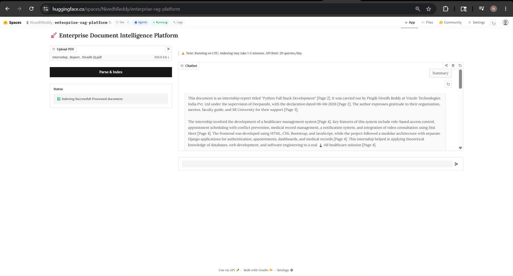

# 🚀 Enterprise Document Intelligence Platform

> **An enterprise-grade Hybrid Retrieval-Augmented Generation (RAG) platform for intelligent document understanding, semantic search, grounded question answering, and citation-based AI reasoning.**

---

## **🔴 Live Demo:** [Click here to test the app](https://huggingface.co/spaces/NivedhReddy/enterprise-rag-platform)  

## 📸 Enterprise Dashboard



---

# 🌟 Overview

Enterprise Document Intelligence Platform is an advanced Retrieval-Augmented Generation (RAG) system engineered to provide accurate, grounded, and explainable answers from large PDF documents.

Unlike traditional PDF chatbots that rely only on vector similarity, this platform combines **Hybrid Retrieval**, **Cross-Encoder Re-ranking**, **Semantic Search**, **BM25 Keyword Matching**, **Grounded Citations**, and **Enterprise Monitoring** to improve retrieval quality while reducing hallucinations.

The platform features a modern enterprise dashboard for document ingestion, health monitoring, query analytics, evidence visualization, and intelligent document interaction.

---

# ✨ Features

## 📄 Intelligent Document Processing

- PDF Upload & Indexing
- Automatic Metadata Extraction
- OCR Support for Scanned PDFs
- Recursive Semantic Chunking
- Parent-Child Context Preservation

---

## 🔍 Enterprise Hybrid Retrieval

- Dense Semantic Search (BGE Embeddings)
- BM25 Sparse Keyword Search
- Hybrid Retrieval Fusion
- Cross-Encoder Re-ranking
- Context Compression
- Adaptive Retrieval Strategy

---

## 🤖 AI Reasoning

- Gemini 2.5 Flash
- Grounded Prompt Engineering
- Citation-aware Responses
- Hallucination Prevention
- Confidence Estimation
- Evidence-based Answer Generation

---

## 📊 Enterprise Dashboard

- Live Document Statistics
- Document Registry
- Query Analytics
- Confidence Score
- Retrieval Score
- Latency Monitoring
- Evidence Viewer
- Suggested Prompts
- Health Monitoring Dashboard

---

## 🛡 Enterprise Reliability

- Automatic API Quota Detection
- Runtime Error Handling
- Persistent Document Registry
- ChromaDB Persistence
- Metadata Caching
- Embedding Cache
- Health Diagnostics

---

# 🧠 Why Hybrid RAG?

Traditional RAG systems often struggle with:

- Missing exact keywords
- Poor retrieval of numeric information
- Weak semantic understanding
- Hallucinated answers
- Long document reasoning

This project addresses these challenges by combining multiple retrieval techniques into a unified enterprise pipeline.

---

# 🏗 System Architecture

```
                User Uploads PDF
                        │
                        ▼
              PDF Parsing + OCR
                        │
                        ▼
          Recursive Semantic Chunking
                        │
                        ▼
        BGE Large Embedding Generation
                        │
                        ▼
             Chroma Vector Database
                        │
            ┌───────────┴───────────┐
            ▼                       ▼
     Dense Vector Search       BM25 Search
            │                       │
            └───────────┬───────────┘
                        ▼
             Hybrid Retrieval Fusion
                        │
                        ▼
          Cross Encoder Re-ranking
                        │
                        ▼
            Context Compression
                        │
                        ▼
           Gemini 2.5 Flash LLM
                        │
                        ▼
     Grounded Response + Citations
```

---

# ⚙ Technology Stack

## Programming Language

- Python

---

## Large Language Model

- Gemini 2.5 Flash

---

## Embedding Model

- BAAI/bge-large-en-v1.5

---

## Retrieval

- ChromaDB
- BM25
- Hybrid Search
- Cross Encoder Re-ranking

---

## Frameworks

- LangChain
- Gradio

---

## Document Processing

- PyMuPDF
- PyPDF
- OCR Pipeline

---

## Libraries

- Sentence Transformers
- Rank BM25
- Pandas
- NumPy

---

# 🚀 Core Engineering Components

## Hybrid Retrieval Engine

Combines:

- Dense Vector Search
- BM25 Keyword Search
- Retrieval Fusion
- Cross-Encoder Re-ranking

to improve retrieval precision and reduce hallucinations.

---

## Cross Encoder Re-ranking

Candidate chunks retrieved from Hybrid Search are re-ranked using a Cross Encoder model to improve contextual relevance before being sent to the LLM.

---

## Grounded Citation Engine

Every generated response includes citations extracted directly from retrieved document chunks.

Example:

```
Mars is the fourth planet from the Sun.

[SOURCE:
Deep_Solar_System_Report.pdf
Page 3]
```

---

## Evidence Viewer

Every response is accompanied by:

- Retrieved Document
- Page Number
- OCR Status
- Retrieval Score
- Evidence Preview

allowing complete transparency of the reasoning process.

---

## Enterprise Health Dashboard

The system continuously monitors:

- Document Count
- Pages Indexed
- Metadata Cache
- Embedding Cache
- ChromaDB Status
- BM25 Status
- OCR Status
- Persistence
- Memory Statistics
- Registry Size

---

## Query Analytics

Each query displays:

- Confidence Score
- Query Latency
- Retrieved Chunks
- Top Re-ranking Score

providing insights into retrieval quality.

---

# 💻 Enterprise UI

The platform includes a professional enterprise interface with:

- KPI Dashboard
- Upload Center
- Document Registry
- AI Chat Workspace
- Suggested Prompts
- Query Analytics
- Evidence Viewer
- Health Monitoring
- Advanced Diagnostics

---

# 📂 Project Structure

```
Enterprise_RAG_Assistant.ipynb
README.md
Enterprise_UI.png
```

---

# 🚀 Running the Project

## Clone Repository

```bash
git clone https://github.com/NivedhReddy2048/enterprise-document-intelligence-platform.git
```

---

## Install Dependencies

```bash
pip install -U \
langchain \
langchain-community \
langchain-google-genai \
langchain-huggingface \
sentence-transformers \
chromadb \
rank-bm25 \
gradio \
pymupdf \
pandas \
numpy
```

---

## Configure API Key

```python
import os

os.environ["GOOGLE_API_KEY"] = "YOUR_GEMINI_API_KEY"
```

---

## Launch

Open the notebook and execute all cells.

The Gradio interface will launch automatically.

---

# 📈 Current Capabilities

✔ Large PDF Processing

✔ OCR Support

✔ Hybrid Retrieval

✔ Dense + Sparse Search

✔ Cross Encoder Re-ranking

✔ Grounded Citations

✔ Enterprise Dashboard

✔ Query Analytics

✔ Health Monitoring

✔ Evidence Viewer

✔ Confidence Estimation

✔ ChromaDB Persistence

✔ Intelligent Document Search

---

# 🔮 Future Improvements

- Multi-document Retrieval
- Knowledge Graph Integration
- Agentic Workflows
- Table Extraction
- Image Understanding
- Multi-modal RAG
- Azure OpenAI Support
- Docker Deployment
- Kubernetes Deployment
- AWS Integration
- Pinecone / Qdrant Support

---

# 👨‍💻 Author

## Pingili Nivedh Reddy

AI Engineer | Retrieval-Augmented Generation | LLM Applications | Intelligent Search Systems

GitHub:
https://github.com/NivedhReddy2048

---

# ⭐ Project Highlights

- Enterprise-grade Hybrid RAG
- Explainable AI with Grounded Citations
- Cross-Encoder Re-ranking
- Professional Enterprise Dashboard
- OCR-enabled Document Intelligence
- Query Analytics & Monitoring
- Production-style Architecture
- Modular and Extensible Design

---

## If you found this project useful, consider giving it a ⭐ on GitHub.
